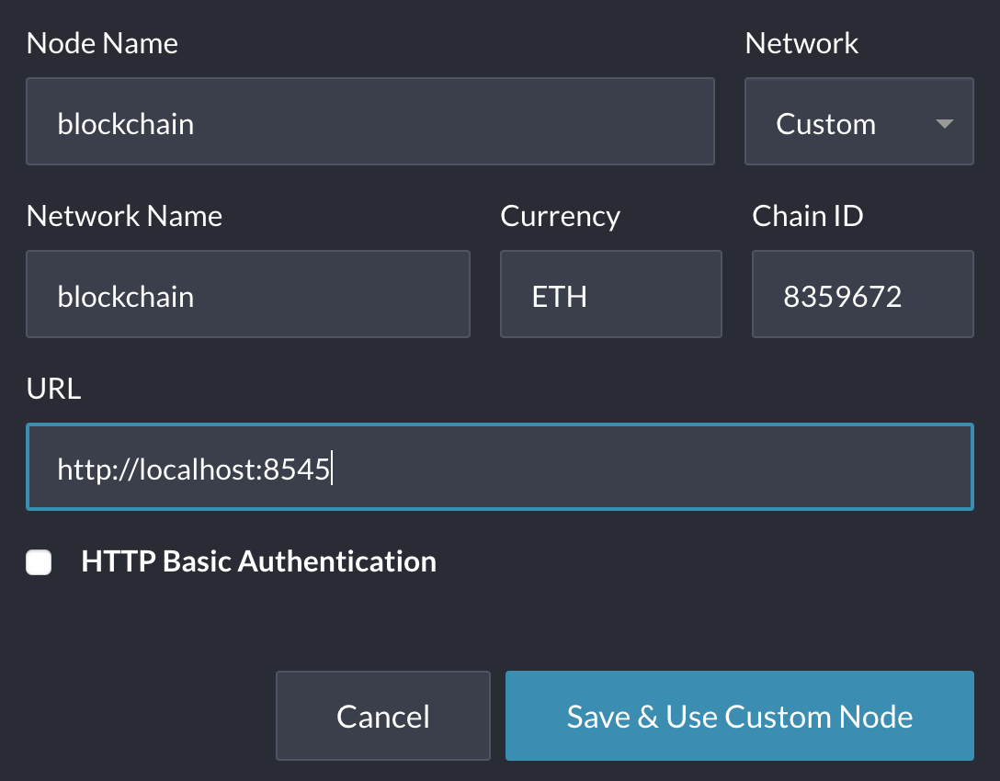
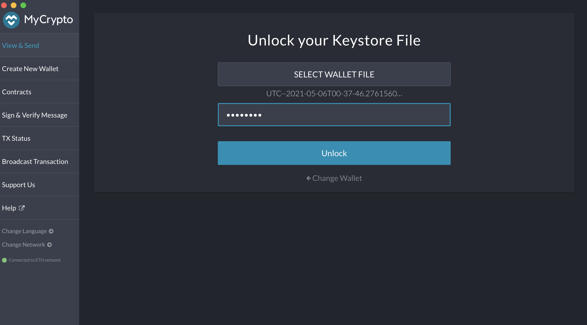
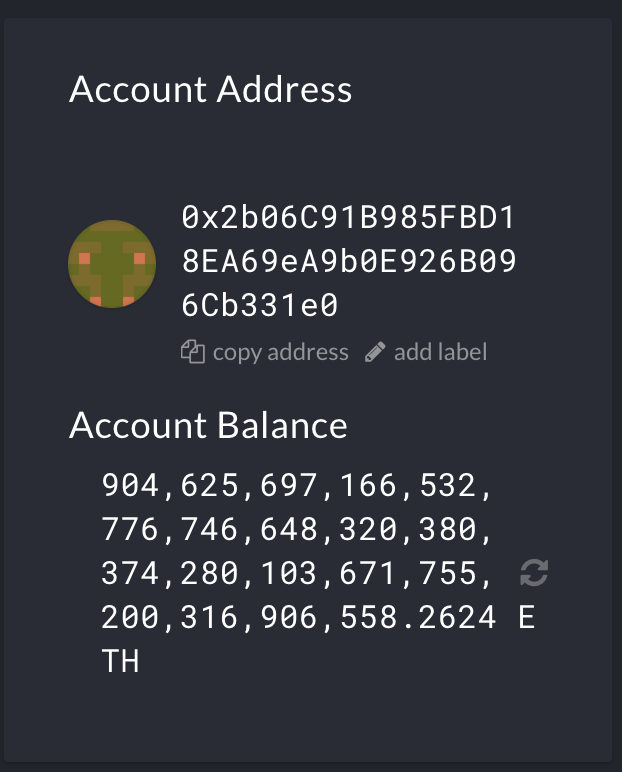
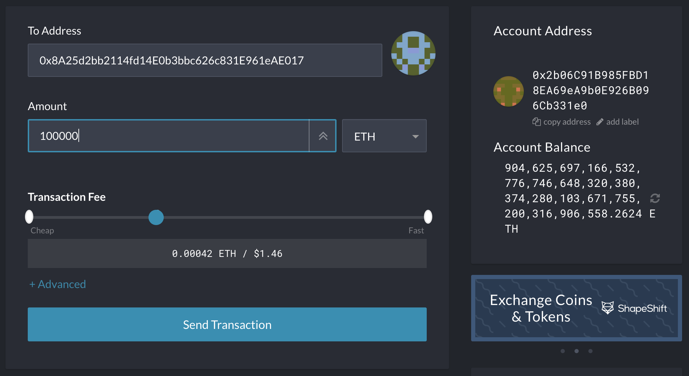
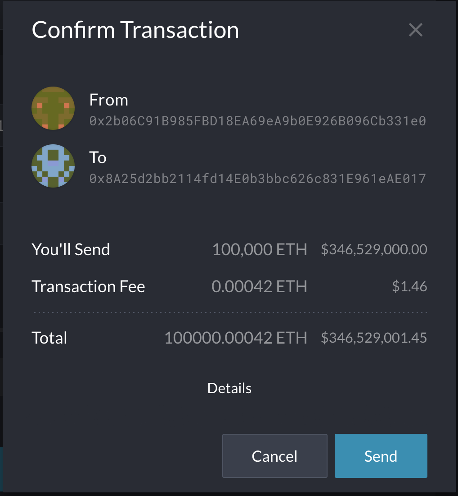
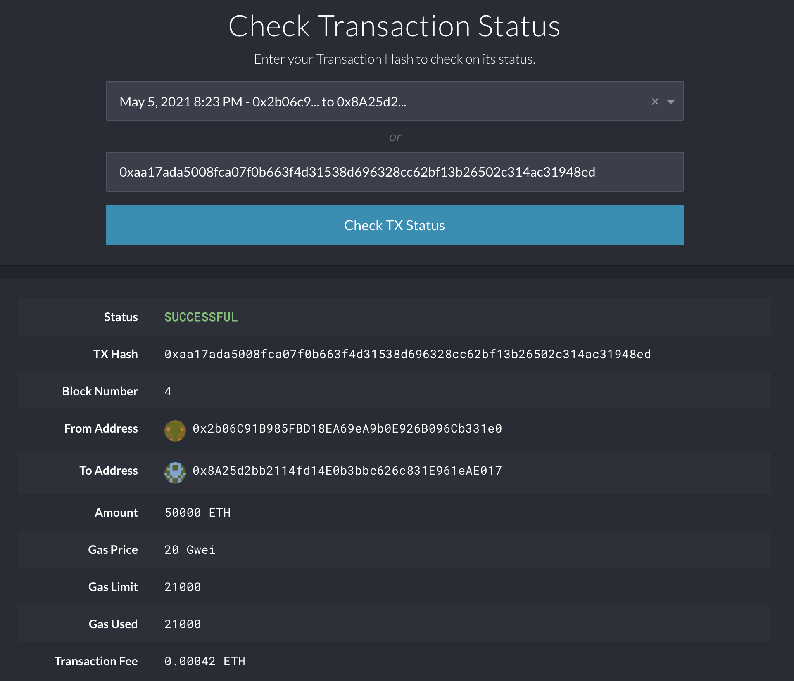
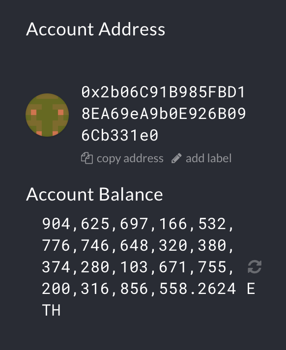

# Blockchain Proof of Authority

For this assignment, I created a private blockchain network that uses proof of authority. I did this using geth to create ethereum nodes. After creating the blockchain, I passed a transaction between my different node addresses.

## Blockchain setup

In order to setup my blockchain, I followed the following steps:
* Set up new nodes using geth
* Set up genesis block using puppeth
* Initialize the nodes using the network json
* Begin mining the nodes in the terminal

### Step 1: Setting up new nodes

First and foremost, the Go Ethereum "Geth & Tools" must be installed on your computer before you can set up nodes and genesis blocks. This can be installed here: https://geth.ethereum.org/downloads/.

Since I already had directories on my computer for node1 and node2 (which were initialized with a proof of work genesis block), I set up node3 and node4. I did this to create 2 new addresses that I would use to add to the POA genesis block. The code for setting up the nodes is:

* ./geth --datadir node# account new
    * This code is creating new folders for the nodes and in this step you are required to enter a password for the account. This password will be used to unlock the account when the blockchain is initiated.
    * In order for this command to run successfully, you have to be in the Blockchain-Tools folder set up on your computer.

### Step 2: Setting up genesis block

In order to create a new genesis block, while in the Blockchain-Tools folder, you must run the code <b>./puppeth</b>. This will begin the process of setting up a network and genesis block. The following steps should be followed to set up the private network and subsequently the genesis block:
1. Enter network name (I chose <u>blockchain</u>).
2. Choose option 2 to configure new genesis
3. Choose option 1 to create new genesis from scratch
4. Choose option 2 for proof of authority
5. Enter the amount of seconds for the blocks (I went with default 15)
6. Enter the accounts that will be allowed to seal
    * The two accounts entered are the accounts generated when you are creating your nodes.
7. Enter the accounts that will be pre-funded
    * These are the same two accounts as the last step
8. Enter "no" for pre-funding the pre-compiled accounts with wei.
9. Specify your chain ID
    * This will be used when setting up a new custom node in MyCrypto to log into your wallet.
10. Lastly, you will go into option 2 to manage your existing genesis and export the network configurations. This will create the json file for the network.

### Step 3: Initialize the nodes

After you have set up your genesis block, you can control+C to exit the puppeth interface. You will now need to link your nodes to your network via the json we exported. The code is as follows:
* ./geth --datadir node# init networkname.json
    * You need to run this code for both nodes that you set up. In my case, I would run this for node3 and node4 using blockchain.json

### Step 4: Begin mining the nodes

For the last step, we will begin mining blocks on our network. Using two separate terminals, we will enter codes that will allow our two nodes to speak to each other and mine the blocks. The codes are as follows:
* ./geth --datadir node3 --unlock "SEALER_ONE_ADDRESS" --mine --rpc --allow-insecure-unlock
* ./geth --datadir node4 --unlock "SEALER_TWO_ADDRESS" --mine --port 30304 --bootnodes "enode://SEALER_ONE_ENODE_ADDRESS@127.0.0.1:30303" --allow-insecure-unlock

We include the --unlock portion of the code here because we need to verify the proof of authority. After running these codes, you will be prompted to enter the password you used to set up the nodes. Once the password is input, we can successfully mine blocks. Once this process has begun, we can go into our wallet and begin transacting.

## Using MyCrypto for Transactions

Now that our blockchain is up and running, we will be using the program MyCrypto to send a test transaction between our two accounts. These are the steps we need to take in order to successfully transact:
* Set up a custom network for our blockchain
* Log into our wallet using the UTC Keystore generated in our first node
* Sending and verifying a transaction in MyCrypto

### Step 1: Setting up the custom node

In order to log into our wallet, we need to set up a custom network in MyCrypto that ties to the network our blockchain is running on. In order to do this, you click the "Change Network" button in MyCrypto and then click "Add Custom Node" at the very bottom of the screen. Once here, you will change the "Network" dropdown and enter the inputs as below:

The node and network names here are customizable, but the currency must be ETH and the Chain ID must match the Chain ID you input when setting up your genesis block. This will allow us to link to our blockchain. 
After these inputs, you can click save & use custom node. Once connected, we will be able to connect to our wallet.

### Step 2: Logging in to our wallet

Once our custom node is set up, we click back into "view & send" on the left navigation pane of MyCrypto. Once here, there is an option to log into your wallet with your Keystore File. Navigate to this option. 
Once here, you can upload your UTC file that was generated when creating your nodes. This should be the UTC from the first node. In my case, this will be node3. After you select the file, you will be prompted to input your password. After entering, you should gain access to your wallet.

Since we pre-funded our wallet when setting up the genesis block, you should see a large amount of ETH in the wallet. That is how we know we are connected properly. This is the amount of ETH in my wallet after unlocking it:

### Step 3: Sending and verifying transactions

Now that we have unlocked our wallet, we will send a test transaction to our secondary address. This is the address generated when we created our second node. The inputs are as such:

You will then be prompted to confirm this:

Once you click send, a hash number will be generated for us to track the transaction:

Lastly, you can click through to check transaction status. Initially it will be set to pending while the blockchain is mining the transaction. You can also verify this in your terminal. The transaction should appear as mined. Once it is mined, the status of the transaction should change to successful in MyCrypto.

After you confirm that the transaction is successful, you should be able to see the change in ETH reflected in your wallet. Log back in with the same keystore file and verify the transaction. My account reflected:

 

After this, we are all done with our transaction! You can shut down your mining in the terminal.